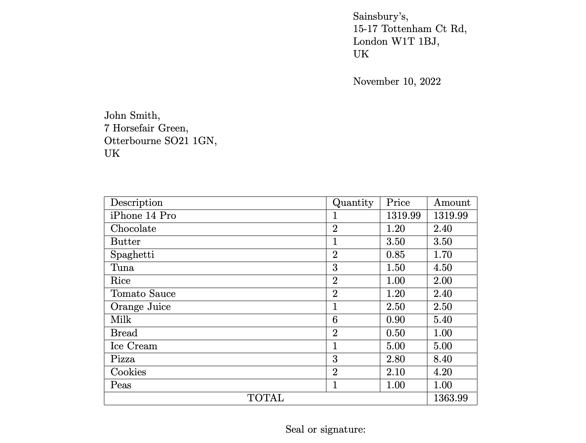

# Bill Generator

Bill Generator é unha implementación en [Elixir](https://elixir-lang.org/) dunha arquitectura pipe and filter, sendo cada un destos filtros unha implementación de [GenServer](https://hexdocs.pm/elixir/1.12/GenServer.html). Baséase na xeración de facturas en formato PDF a partires dunha lista de productos e cantidades, un comprador, e un vendedor, usando código LaTeX como intermediario. 

## Instalación

Para clonar o repositorio, pódese usar calquera software compatible con GitHub, entre elas, o comando:

    git clone https://github.com/GEI-AS-614G010262223/arquitectura-alejandrobujan.git

Teremos que descargar as dependencias asociadas ao proxecto, polo tanto, dentro do directorio do repositorio, usamos:

    mix deps.get


## LaTeX

É preciso ter un sistema TeX instalado, incluíndo `latex`, `pdflatex` ou calquera outra variante que desexes usar para compilar o teu código fonte `.tex` en documentos PDF (a configuración predeterminada asume que `pdflatex` está instalado para a xeración de PDF).

Podes descargar e instalar un sistema TeX no sitio web do [Proxecto LaTeX](https://latex-project.org/ftp.html) ou usando o xestor de paquetes que elixas.

## Probas

Este proxecto conta con dúas probas nos que se validan respectivamente a correcta xeración de código LaTeX e a creación os documentos.

Para executar as probas asociadas a este proxecto:

    mix test

## Exemplo de execución

Antes de nada, para compilar e inicializar todo o entorno de execución Elixir usamos:

    iex -S mix

(Poden saltar warnings na primeira vez, isto son advertencias relativas a código dunha dependencia, só ocorre a primeira vez. Non corresponde ao contexto da práctica.)

Para xerar unha factura precisaremos unha lista de tuplas de produto e cantidade deste, formando así a estrutura dunha factura. Tamén precisaremos un comprador e un vendedor (ambos son strings):

```elixir
list = [{%Product{name: "iPhone 14 Pro", price: 1319.99}, 1},
    {%Product{name: "Chocolate", price: 1.20}, 2},
    {%Product{name: "Butter", price: 3.50}, 1},
    {%Product{name: "Spaghetti", price: 0.85}, 2},
    {%Product{name: "Tuna", price: 1.50}, 3},
    {%Product{name: "Rice", price: 1.00}, 2},
    {%Product{name: "Tomato Sauce", price: 1.20}, 2},
    {%Product{name: "Orange Juice", price: 2.50}, 1},
    {%Product{name: "Milk", price: 0.90}, 6},
    {%Product{name: "Bread", price: 0.50}, 2},
    {%Product{name: "Ice Cream", price: 5.00}, 1},
    {%Product{name: "Pizza", price: 2.80}, 3},
    {%Product{name: "Cookies", price: 2.10}, 2},
    {%Product{name: "Peas", price: 1.00}, 1}]
seller = "Sainsbury's, 15-17 Tottenham Ct Rd, London W1T 1BJ, UK"
purchaser = "John Smith, 7 Horsefair Green, Otterbourne SO21 1GN, UK"
```

Para xerar un pdf, enviamos este input ao sistema:

```elixir
BillGenerator.Application.generate(list, seller, purchaser)
```

Agora, dentro do directorio `out` podemos atopar a factura xerada, gardada cun nome con patrón `bill-<y>-<m>-<d>-<h>-<M>-<s>.pdf` que dependerá da data e hora na que foi xerada. 

Neste caso, xerarase un documento co seguinte contido:



## Outra documentación

Os diagramas C4 atópanse no directorio `doc` do repositorio:
+ [Contexto](doc/contexto.png)
+ [Contedor](doc/contedor.png)
+ [Compoñente](doc/componhente.png)
+ [Código](doc/codigo.png)

O proxecto tamén ten soporte para xerar documentación HTML con [ExDoc](https://github.com/elixir-lang/ex_doc), sen embargo, hai que ter en conta que a xeración destes documentos realizaríase no directorio `doc` e eliminaría todo o contido existente nese directorio como todo relacionado cos diagramas C4 entre outros. Unha boa solución sería mover os diagramas e imaxes actualmente no directorio `doc` a outro directorio, pero por agora, iso xeraría un conflicto coas especificacións do enunciado. 

De todas formas para xerar a documentación HTML (sendo consciente de que se sobreescribe o directorio `doc`):

    mix docs

## Autoría

Este proxecto foi creado por **Alejandro Buján Pampín** no marco da segunda práctica da asignatura Arquitectura do Software, do Grao en Enxeñaría Informática da [Universidade da Coruña](http://udc.es).

LaTeX é software libre e non se distribúe con este proxecto (non afiliado). Consulte a páxina de inicio de [LaTeX](https://www.latex-project.org/) para obter máis información.